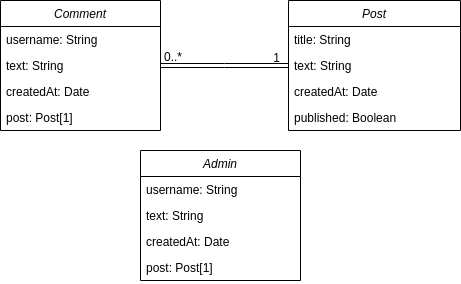

# Blog (server segment)
## Description
This project is the part of the [TOP project: blog api](https://www.theodinproject.com/lessons/nodejs-blog-api). This part represents backend which serves two frontends.  
**Other parts:**
- [blog-clients](https://github.com/JuliaShlykova/blog-clients)
- [blog-admin](https://github.com/JuliaShlykova/blog-admin)  

**API services:**
- create and send posts information
- create comments
- log in as admin
## Data Models

## Technologies used
- NodeJS
- Express
- MongoDB database
- Mongoose
- jsonwebtoken